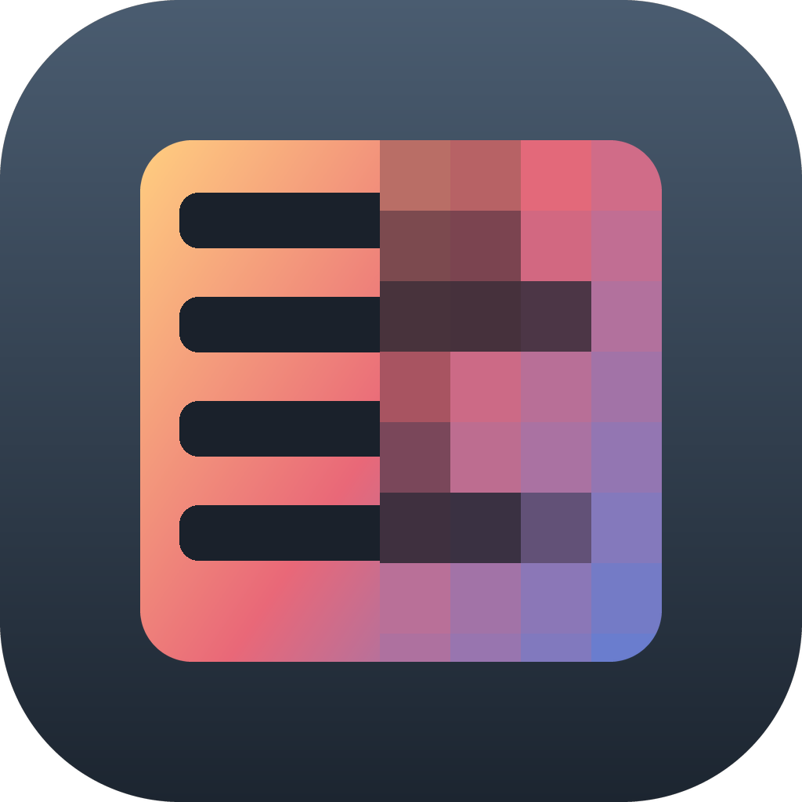

# Pixelator

A Finder Quick Action for pixelating, blurring, or blacking out part of an image.

Right-click any image in Finder → **Quick Actions → Pixelate Image**. A window opens,
you drag rectangles over whatever should be hidden, hit ⌘S, and a copy lands next to
the original as `name-pixelated.png`. Originals are never modified.



## Install

Xcode Command Line Tools are the only prerequisite (`xcode-select --install`).

```zsh
git clone https://github.com/tsvoronos/pixelator.git
cd pixelator
./install.sh
```

That's the whole thing — on this machine or any other. It compiles `main.swift`,
installs `Pixelator.app` with its icon, and installs the Finder Quick Action. Nothing
is downloaded, so Gatekeeper won't quarantine it.

| | |
|---|---|
| `./install.sh` | build the app + install the Quick Action |
| `./install.sh --app-only` | skip the Quick Action |
| `PIXELATOR_APP=/Applications/Pixelator.app ./install.sh` | install to a specific path |

By default it installs to `~/Applications/Pixelator.app`, or rebuilds in place if a
copy already exists at `/Applications/Pixelator.app`. Re-run it any time to rebuild;
quit the app first if it's running.

**The first time** you use it on a file in Desktop, Documents or Downloads, macOS
asks permission to read that folder — click **Allow**. Until you do, the app can't
read the file and will tell you so. If you dismissed it, re-grant under System
Settings → Privacy & Security → Files and Folders.

## Three ways to open an image

- **Quick Action** — right-click in Finder → Quick Actions → Pixelate Image. Select
  several images at once and it queues them.
- **Open With** → Pixelator.
- **Command line** — `open -n -b local.pixelator --args some.png`

## Controls

| | |
|---|---|
| drag | pixelate/blur/black out that rectangle |
| `1` / `2` / `3` | pixelate / blur / solid black |
| `[` / `]` | weaker / stronger (pixelate and blur only) |
| ⌘Z | undo last rectangle |
| ⌘S | save copy next to original, advance to next image |
| ⌘W | skip this image without saving |
| ⌘Q | quit |

Strength applies to the *next* rectangle you drag — each one is flattened into the
bitmap at mouse-up, so changing it won't revisit earlier rectangles. Saved files get
revealed in Finder when the queue finishes.

## How the pixelation works

Each rectangle is averaged down to `region ÷ blockSize` pixels with high-quality
interpolation, then scaled back up with interpolation **off**. That gives hard-edged
square blocks with no soft gray fringe at the boundary — the artifact that makes most
cheap redaction tools look bad.

Block size scales with the image's short side (0.5% / 1.1% / 2.2%), so a 900px
screenshot and a 6000px photo end up looking similarly pixelated rather than one
being unreadable mush and the other barely touched. Measured on a 700px-short-side
image that's 4/8/15px blocks; on a 2400px one, 12/26/54px. Blur radius scales the
same way (0.8% / 1.6% / 3.2%).

## Things worth knowing

- **It's called Pixelator, not Redactor, on purpose.** Pixelating and blurring are
  reversible transforms, so calling the output "redacted" would overclaim. Output
  files are named `-pixelated`.
- **Edits are destructive.** Each rectangle is flattened into the bitmap immediately.
  There are no layers in the output file to peel back.
- **Pixelate and blur are still reversible transforms.** For text you actually need
  gone — names, IDs, grades — use solid black (`3`). Pixelated and blurred text has
  been recovered in practice. Pixelation is fine for faces and for the "this is
  redacted" visual effect.
- **EXIF is stripped.** The copy is re-encoded from raw pixels, so location and
  device metadata don't survive. Verified against input carrying Make, Model,
  DateTime, Software and GPS coordinates: none of it reaches the output.
- **EXIF orientation is baked in**, so rotated phone photos come out upright.
- **JPEG in → JPEG out** (quality 0.92). Everything else → PNG. 16-bit input is
  flattened to 8-bit; grayscale and palette input come out RGBA.

## Layout

```
main.swift              the whole app (~460 lines, AppKit + CoreImage)
install.sh              build + install app and Quick Action
assets/Pixelator.icns   app icon (committed; no build step needed)
make-icon.py            regenerates the icon art — needs Pillow, optional
quickaction/            the Quick Action bundle contents, copied into place
```

### A note on the Quick Action

It's assembled from plists in `quickaction/` rather than built by hand in Automator,
so it installs unattended. If you ever rebuild it, the field that matters is:

```
serviceInputTypeIdentifier = com.apple.Automator.fileSystemObject.image
```

`com.apple.Automator.image` is not a real identifier — with it the action appears in
the right-click menu and silently does nothing. The value above is what Apple's own
`Set Desktop Picture.workflow` uses. The shell action must also pass input **as
arguments**, not stdin, and resolve the app by bundle id (`local.pixelator`) so moving
the app doesn't break it.

## Uninstall

```zsh
rm -rf ~/Applications/Pixelator.app /Applications/Pixelator.app
rm -rf ~/Library/Services/"Pixelate Image.workflow"
killall Finder
```
